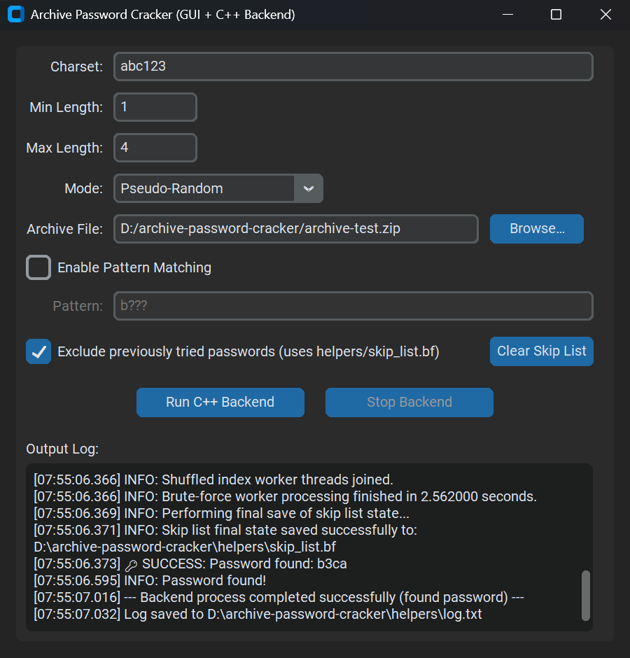

# 🔐 Archive Password Cracker (Python GUI + C++ Core + Pattern Matching + State Persistence)

A high-performance, multi-threaded archive password cracker featuring a **modern Python GUI** (built with CustomTkinter) controlling a robust **C++ backend** for maximum cracking speed. It supports standard brute-force attacks within a defined character set and length range, **pattern matching** to target specific password structures, and utilizes the external 7-Zip command-line tool (`7z.exe`/`7z`) for efficient password verification against various archive types (ZIP, 7z, RAR, etc.). Crucially, it includes **state persistence** using a Bloom filter (`skip_list.bf`) to avoid re-testing previously tried passwords across sessions, even for interrupted runs.

This hybrid architecture leverages the strengths of both languages:
*   **Python/CustomTkinter:** Provides a sleek, user-friendly, and configurable interface. It handles user input (charset, min/max length, pattern, cracking mode, skip list usage), loads default settings from JSON files, manages the C++ process lifecycle (including graceful stops via a flag file), displays real-time progress, and provides controls for managing the skip list state. Includes enhancements like drag-and-drop, undo/redo, dynamic UI updates for pattern matching, and high-DPI support.
*   **C++:** Executes the computationally intensive password generation and testing logic. It uses native multi-threading (`std::thread`) for parallel processing across CPU cores and efficient OS primitives (`CreateProcessW`/`fork`) for launching 7-Zip, minimizing overhead. Supports multiple cracking strategies (ascending, descending, pseudo-random) within the specified constraints (length range or pattern). Implements **pattern-based password generation** and validation. Includes a **Bloom filter** for efficient tracking of tested passwords, with optional **checkpointing** for resilience and a **stop flag mechanism** for graceful termination and state saving. Robustly handles large search spaces and potential memory allocation limits for the Bloom filter.

---

### GUI Preview

<p align="center">
  
</p>
<p align="center"><em>Screenshot of Archive Password Cracker GUI</em></p>

---

## Table of Contents

1.  [Overview](#overview)
2.  [Features](#features)
    *   [Core Functionality](#core-functionality)
    *   [GUI Enhancements](#gui-enhancements-python)
3.  [How it Works](#how-it-works)
4.  [Pattern Matching Syntax](#pattern-matching-syntax)
5.  [Project Structure](#project-structure)
6.  [Requirements](#requirements)
7.  [Setup Instructions](#setup-instructions)
    1.  [Get the Code](#1-get-the-code)
    2.  [Install 7-Zip](#2-install-7-zip)
    3.  [Compile the C++ Backend](#3-compile-the-c-backend)
    4.  [Place C++ Executable](#4-place-c-executable)
    5.  [Install Python Dependencies](#5-install-python-dependencies)
    6.  [(Optional) Edit Default Values](#6-optional-edit-default-values)
8.  [Usage](#usage)
9. [Building](#building)
    1.  [Building the C++ Backend (CLI)](#building-the-c-backend-cli)
    2.  [Building the Python GUI Standalone Executable](#building-the-python-gui-standalone-executable)
10. [License](#license)
11. [Acknowledgements](#acknowledgements)

---

## Overview

This tool attempts to find the password for encrypted archive files using a multi-threaded approach. Users can define a character set (`Charset`), a **minimum (`Min Length`)** and **maximum (`Max Length`)** password length for standard brute-force, or enable **Pattern Matching** to specify the exact structure of the passwords to test. A cracking `Mode` (Ascending, Descending, Pseudo-Random) dictates the generation order.

---

**Key Architecture & Features:**

*   **Python GUI (`archive_password_cracker.py`):** Manages the user interface, loads defaults (from `helpers/json/`), gathers settings, validates input (including dynamic adjustments based on pattern matching), launches the C++ backend process, reads its output in real-time via separate threads, and updates the log display without blocking the UI. Controls the skip list feature and provides a button to clear its state. Creates the `.stop` flag for graceful termination.
*   **C++ Backend (`helpers/ArchivePasswordCrackerCLI.exe`):** A command-line application that receives the charset, min/max length, archive path, cracking mode, and optional skip list/pattern parameters as arguments.
    *   It finds the required `7z` executable (expected in `helpers/bin/`).
    *   **Pattern Handling:** If the `--pattern` argument is provided, it parses the pattern and generates only passwords matching that specific structure, adjusting length constraints automatically.
    *   **Standard Brute-Force:** If no pattern is provided, it generates passwords sequentially or randomly within the specified `Min Length` and `Max Length`.
    *   Spawns multiple worker threads for parallel processing.
    *   **Skip List:** If enabled (`--skip-file <path>`), it loads/creates a **Bloom filter** (`helpers/skip_list.bf`). Before testing a password, it checks the filter (`contains()`). If potentially seen, it skips the test. If tested and fails, it's added (`insert()`). Includes checks to prevent creating excessively large filters that might exhaust memory.
    *   **Checkpointing:** If enabled (`--checkpoint-interval <seconds>`), the Bloom filter state is periodically saved (`serialize()`).
    *   **Graceful Stop:** Monitors for a `.stop` flag file (`helpers/skip_list.bf.stop`). If detected, sets an internal flag, ensures worker threads terminate, triggers a final save of the Bloom filter state (if valid and enabled), and terminates the cracking process cleanly.
    *   Efficiently calls the 7-Zip process (`tryPassword`) to verify each password candidate.
    *   Status messages and the final result (if found) are printed to standard output for the Python GUI to capture.

This separation ensures the UI remains responsive while the C++ backend utilizes CPU resources effectively, with the added benefits of targeted pattern attacks and persistent state to avoid redundant work.

---

## Features

### Core Functionality

| Category              | Feature                                       | Details                                                                                                                                                            |
| :-------------------- | :-------------------------------------------- | :----------------------------------------------------------------------------------------------------------------------------------------------------------------- |
| **✨ GUI (Python)**    | Modern Interface                          | Built with CustomTkinter (Dark/Light themes). High-DPI aware.                                                                                                     |
|                       | Configurable Defaults                     | Loads initial Charset, Min/Max Length, Archive Path from `helpers/json/*.json`.                                                                                   |
|                       | **Versatile Generation**                  | Supports both **Length Range (Min/Max)** brute-force and targeted **Pattern Matching**.                                                                           |
|                       | **Pattern Control**                       | Checkbox to enable pattern mode. Dedicated input field for the pattern string. Dynamically enables/disables Min/Max Length fields based on pattern content (`*`). |
|                       | **Mode Selection**                        | Choose cracking strategy: **Ascending**, **Descending**, or **Pseudo-Random**. Applies to length range or pattern generation where applicable.                     |
|                       | **Skip List Management**                  | Checkbox to enable/disable skipping previously tried passwords (`helpers/skip_list.bf`). Button to clear the stored skip list state.                                |
|                       | Live Output Log                           | Displays real-time, timestamped status/results from the C++ backend.                                                                                              |
|                       | Responsive Controls                       | Run/Stop buttons control the C++ backend; UI remains interactive. Graceful stop via flag file.                                                                     |
|                       | Input Validation                          | Checks lengths, charset, archive path, pattern interactions, preventing invalid C++ calls.                                                                       |
| **⚡ Core (C++)**     | **High Performance**                      | Native C++ speed, `std::thread` parallelism, efficient OS process calls (`CreateProcessW`/`fork`).                                                               |
|                       | **Pattern Matching Engine**               | Parses patterns (`?`, `*`, `\\`), generates candidates matching the exact structure. Handles fixed vs. variable length patterns.                                  |
|                       | **Standard Brute-Force**                  | Efficiently generates passwords within Min/Max length range if no pattern is specified.                                                                          |
|                       | **Multiple Cracking Modes**               | Implements Ascending, Descending, and Pseudo-Random strategies for both standard and applicable pattern modes.                                                  |
|                       | **State Persistence (Skip List)**         | Uses a **Bloom Filter** (`bloom_filter.h/.cpp`) to efficiently track tested passwords (low memory, fast checks) via `helpers/skip_list.bf`.                           |
|                       |                                               | Loads state if `--skip-file` is used. Skips known attempts (`contains()`). Adds new failures (`insert()`).                                                         |
|                       | **Memory Safety**                         | Checks estimated Bloom filter size against a limit (`MAX_FILTER_BITS`) before allocation to prevent excessive memory usage; disables skip list if limit exceeded. |
|                       | **Checkpointing**                         | Periodically saves Bloom filter state (`serialize()`) if `--checkpoint-interval` is used.                                                                        |
|                       | **Graceful Stop & Resume**                | Checks for `.stop` flag file. Saves valid skip list state on stop/completion, allowing continuation.                                                               |
|                       | Efficient 7-Zip Integration               | Directly calls `7z.exe`/`7z` for password verification. Finds `7z` in `helpers/bin/`.                                                                          |
|                       | Robust Random Mode                        | Uses `std::shuffle` with a non-deterministic seed for standard and pattern-based random modes (where applicable).                                             |
| **⚙️ Architecture**    | **Hybrid Design**                         | Python UI/Management + C++ Performance/Logic.                                                                                                                      |
|                       | Process Communication                     | Python `subprocess` launches C++, passes config via args, reads `stdout`/`stderr` via threads.                                                                     |
|                       | Clear Separation                          | GUI and cracking logic are distinct processes.                                                                                                                   |
|                       | Robust Error Handling                     | Detects missing backend/7z, handles invalid args, pattern issues, reports C++ exit codes (0-4+), handles Bloom filter I/O/memory errors.                      |
|                       | Cross-Platform (Potential)                | C++ includes basic Linux/macOS process handling. Python GUI is cross-platform. Tested primarily on Windows.                                                        |

### GUI Enhancements (Python)

*   **🖱️ Drag & Drop:** Drag an archive file onto the "Archive File" input field (requires optional `windnd` library on Windows).
*   **✍️ Undo/Redo:** Standard `Ctrl+Z` / `Ctrl+Y` / `Ctrl+Shift+Z` support on Charset, Min/Max Length, Pattern, and Archive Path fields.
*   **🖼️ High DPI Support:** Adapts to high-resolution displays.
*   **🧭 Dynamic UI:** Min/Max Length fields become disabled/enabled automatically based on the pattern content when Pattern Matching is active.
*   **🤫 Improved Stop UX:** Correctly handles stop requests, ensures C++ saves state (if enabled), and avoids unnecessary "Not Found" popups.
*   **💾 Log Saving:** Automatically saves the Output Log to `helpers/log.txt` on process completion or application close.

---

## How it Works

1.  **Initialization (Python):** The GUI loads default values for Charset, Min/Max Length, Archive Path from `helpers/json/*.json`.
2.  **Configuration (User):**
    *   Adjusts **Charset**, **Min/Max Length**.
    *   Selects **Mode** (Ascending, Descending, Pseudo-Random).
    *   Selects **Archive File** (Browse or Drag & Drop).
    *   Toggles **"Exclude previously tried passwords"** checkbox (controls skip list usage).
    *   Toggles **"Enable Pattern Matching"** checkbox.
    *   If pattern matching is enabled, enters a **Pattern** string (see [Syntax](#pattern-matching-syntax)). The GUI dynamically adjusts the Min/Max Length fields based on the pattern.
3.  **Launch Backend (Python):** On "Run C++ Backend":
    *   Python validates all inputs, including pattern constraints if enabled.
    *   Constructs the C++ command: `helpers/ArchivePasswordCrackerCLI.exe <charset> <min_len> <max_len> <abs_archive_path> <mode>`
    *   Appends optional arguments:
        *   If Skip List checked: `--skip-file "helpers/skip_list.bf" --checkpoint-interval <seconds>`
        *   If Pattern Matching checked: `--pattern "<pattern_string>"`
    *   Launches the C++ process via `subprocess.Popen`, redirecting I/O, setting CWD to `helpers/`.
4.  **Execution (C++):** `ArchivePasswordCrackerCLI.exe`:
    *   Parses all arguments.
    *   Locates `7z.exe` in `helpers/bin/`. Reports error code `3` if not found.
    *   **Skip List Setup:** If `--skip-file` used: attempts `deserialize()`. On failure/no file, calculates estimated items based on length range or pattern constraints. Checks if required filter size exceeds `MAX_FILTER_BITS`. If safe, creates a new `BloomFilter`. If unsafe or error, disables skip list for the run.
    *   **Pattern Mode:** If `--pattern` used: parses the pattern (`parse_pattern`). Determines fixed length, number of wildcards. Enters pattern generation logic.
    *   **Standard Mode:** If no pattern, enters standard length-based generation logic.
    *   **Worker Dispatch:** Divides the work (lengths, indices, or pattern combinations) among worker threads (`numThreads`).
    *   **Password Generation & Testing (Workers/Main):**
        *   Generates candidate password based on mode (standard or pattern).
        *   **Skip Check:** If filter enabled and valid, calls `filter->contains(pwd)`. Skips if `true`.
        *   **7-Zip Test:** If not skipped, calls `tryPassword()` to invoke `7z`.
        *   **Filter Update:** If filter enabled/valid and `tryPassword` fails, calls `filter->insert(pwd)` (thread-safe via mutex).
        *   **Stop Check:** Periodically checks `stop_flag_exists()`. If true, sets atomic `stop_requested` flag and worker exits its loop.
    *   **Checkpointing:** Main thread periodically calls `checkpoint_filter_func` to save valid filter state via `serialize()` if interval elapsed.
    *   **Output:** Prints status (INFO, WARN, ERROR). If password found, prints `FOUND:the_password`.
    *   **Termination:** Exits with code `0` (found), `1` (not found/exhausted), `2` (args error), `3` (7z missing), `4` (path error). Crucially, before exiting (if stopped or found), performs a final check and calls `filter->serialize()` if the filter is valid and enabled.
5.  **Real-time Logging (Python):** Background threads read C++ `stdout`/`stderr`.
6.  **GUI Update (Python):** Lines displayed in the log text box via `app.after`.
7.  **Result Parsing (Python):** Watches for `FOUND:`.
8.  **Monitoring (Python):** `_monitor_process` polls for C++ process exit.
9.  **Completion/Stop (Python):**
    *   **Normal/Found:** `_monitor_process` detects exit, shows popups (unless stopped by user), saves log, re-enables UI.
    *   **Manual Stop:** User clicks "Stop". Python sets `stopped_by_user = True`, creates `helpers/skip_list.bf.stop`. C++ detects flag, saves state (if valid/enabled), exits. Python removes flag. `_monitor_process` cleans up UI *without* final result popups.
    *   **Clear Skip List:** Deletes `helpers/skip_list.bf` after confirmation.

---

## Pattern Matching Syntax

When "Enable Pattern Matching" is checked, the **Pattern** field accepts a string defining the password structure:

*   **Literal Characters:** Any character not listed below represents itself (e.g., `pass`, `123`).
*   **`?` (Question Mark):** Represents exactly **one** character from the specified **Charset**.
*   **`*` (Asterisk):** Represents **zero or more** characters from the specified **Charset**.
    *   If a pattern contains `*`, the **Min Length** and **Max Length** fields remain active and define the total allowed password length range. The `*` will expand to fill the difference.
    *   If a pattern contains **no** `*`, the password length is fixed by the pattern itself, and the Min/Max Length fields will be automatically set and disabled in the GUI.
    *   **Note:** Currently, complex patterns with *multiple* `*` characters might fall back to simpler generation modes in the C++ backend (specifically, random mode is disabled, and index-based generation relies on single `*` logic).
*   **`\` (Backslash):** Escapes the next character. Use `\?`, `\*`, or `\\` to match a literal question mark, asterisk, or backslash.

**Examples:**

| Pattern         | Charset     | Min Len | Max Len | Meaning                                                                 | Length Fields |
| :-------------- | :---------- | :------ | :------ | :---------------------------------------------------------------------- | :------------ |
| `pass????`      | `a-z0-9`    | 8       | 8       | "pass" followed by exactly 4 alphanumeric characters.                   | Disabled      |
| `Test*!`        | `a-zA-Z`    | 6       | 10      | "Test", followed by 0 to 4 letters, ending with "!". (Total len 6-10) | Enabled       |
| `???\\?*`       | `abc`       | 4       | 8       | 3 `abc` chars, literal `\`, 1 `abc` char, 0-3 `abc` chars. (Total 4-8) | Enabled       |
| `User\?1*pass`  | `0-9`       | 9       | 12      | "User?1", 0-3 digits, "pass". (Total len 9-12)                         | Enabled       |
| `abc`           | `a-z`       | 3       | 3       | Exactly "abc".                                                          | Disabled      |

---

## Project Structure

```
archive-password-cracker/
│
├── cpp_backend/              # C++ Backend Source Code
│   ├── archive-password-cracker-cli-vX.Y.Z/ # Example build output folder
│   │   └── ArchivePasswordCrackerCLI.exe # --> Copy this to helpers/
│   ├── src/
│   │   ├── bloom_filter.cpp
│   │   ├── bloom_filter.h
│   │   ├── brute_force.cpp
│   │   ├── brute_force.h
│   │   └── main.cpp
│   └── compile_cli.bat       # Build script for C++ backend (Windows)
│
├── helpers/                  # Resources & Runtime Location for C++ Backend
│   ├── bin/                  # **REQUIRED:** Place 7z.exe & 7z.dll here
│   │   ├── 7z.dll
│   │   └── 7z.exe
│   ├── json/                 # Default configuration files for GUI
│   │   ├── archive_file_map.json
│   │   ├── charset_map.json
│   │   ├── max_length_map.json
│   │   └── min_length_map.json
│   ├── ArchivePasswordCrackerCLI.exe # **REQUIRED:** COMPILED C++ backend
│   ├── log.txt               # (Generated at runtime) Log file
│   └── skip_list.bf          # (Generated at runtime) Bloom filter state
│
├── archive_password_cracker.py # Python GUI Application Script (RUN THIS)
└── README.md                 # This file
```

**Key Locations & Runtime Expectations:**

*   **Run Python:** `python archive_password_cracker.py` from the project root.
*   **Compile C++:** Run `compile_cli.bat` inside `cpp_backend/`.
*   **Place Compiled C++ Exe:** Copy the generated executable (e.g., `ArchivePasswordCrackerCLI.exe`) from the C++ build output folder into the **`helpers/`** directory.
*   **Place 7-Zip:** Copy `7z.exe` and `7z.dll` (on Windows) into the **`helpers/bin/`** directory.
*   **C++ Runtime:** Launched by Python, `ArchivePasswordCrackerCLI.exe` runs with its CWD set to `helpers/`. It finds 7-Zip by looking in `./bin/` (relative to itself). It reads/writes `skip_list.bf` and the `.stop` flag file in its CWD (`helpers/`).
*   **Python Runtime:** Finds the C++ exe in `helpers/`. Reads JSON defaults from `helpers/json/`. Saves logs to `helpers/log.txt`. Creates the `.stop` flag file in `helpers/`.

---

## Requirements

*   **Python:** Python 3.7+ recommended.
*   **Python Libraries:**
    *   `customtkinter`: Modern GUI toolkit (`pip install customtkinter`).
    *   `windnd` (Optional, Windows only): For drag-and-drop support (`pip install windnd`).
*   **C++ Compiler:** A modern C++ compiler supporting C++17 (e.g., g++ via MinGW/MSYS2 on Windows, clang/g++ on Linux/macOS). Must be accessible from the command line/PATH.
*   **7-Zip:** The **command-line executable** (`7z.exe` + `7z.dll` on Windows, or `7z` on Linux/macOS). Required for password testing by the C++ backend.

---

## Setup Instructions

1.  **Get the Code:** Clone the repository or download the project files, maintaining the directory structure.
2.  **Install 7-Zip:**
    *   Download 7-Zip from [www.7-zip.org](https://www.7-zip.org/). Ensure you get the command-line components.
    *   Create a `bin` folder inside the `helpers` directory (`archive-password-cracker/helpers/bin/`).
    *   Copy `7z.exe` and `7z.dll` (on Windows) into this **`helpers/bin/` folder**.
3.  **Compile the C++ Backend:**
    *   Open a terminal/command prompt in the `cpp_backend` directory.
    *   Ensure your C++ compiler (e.g., g++) is in your system's PATH.
    *   *(Windows)* If needed, edit `compile_cli.bat` to point `MINGW_ROOT` to your MinGW/MSYS2 installation directory.
    *   Run the compilation script: `.\compile_cli.bat` (Windows) or the equivalent `g++` command for your OS (see script for example). This links `main.cpp`, `brute_force.cpp`, and `bloom_filter.cpp`.
4.  **Place C++ Executable:**
    *   Locate the compiled executable (e.g., `ArchivePasswordCrackerCLI.exe`) inside the C++ build output folder (e.g., `cpp_backend/archive-password-cracker-cli-vX.Y.Z/`).
    *   Copy this executable into the **`helpers/`** directory at the project root (`archive-password-cracker/helpers/`).
5.  **Install Python Dependencies:**
    *   Open a terminal in the main project root directory (`archive-password-cracker/`).
    *   Run: `pip install customtkinter`
    *   (Optional, Windows) Run: `pip install windnd`
6.  **(Optional) Edit Default Values:**
    *   Modify the content of the `.json` files inside `helpers/json/` to set your preferred default values for the GUI fields (Charset, Min Length, Max Length, Archive File). Each file should contain a JSON list with a single string element (use empty string `""` for no default).

---

## Usage

1.  Complete all **Setup Instructions**.
2.  Open a terminal in the main project root directory (`archive-password-cracker/`).
3.  Run the Python GUI: `python archive_password_cracker.py`
4.  The application window will appear.
5.  Configure the cracking parameters:
    *   Enter the **Charset**.
    *   Check **Enable Pattern Matching** *or* set **Min Length** / **Max Length**.
    *   If Pattern Matching is enabled, enter the **Pattern** (see [Syntax](#pattern-matching-syntax)). Note how Min/Max Length fields may disable.
    *   Select the cracking **Mode**.
    *   Select the target **Archive File**.
    *   Check/Uncheck the **"Exclude previously tried passwords"** checkbox to control usage of `helpers/skip_list.bf`.
6.  Click **Run C++ Backend**.
7.  Monitor the **Output Log** for progress and status.
8.  If found, the password will be printed (`FOUND:password`) and shown in a success pop-up.
9.  If the search completes without finding the password, a "Finished" message appears.
10. Click **Stop Backend** to terminate early. The C++ backend will attempt to save the current skip list state (if enabled and valid) before exiting.
11. Click **Clear Skip List** to discard the learned state (prompts for confirmation).

---

## Building

### Building the C++ Backend (CLI)

Use the `cpp_backend/compile_cli.bat` script (Windows) or adapt the `g++` command for Linux/macOS, as done during setup. This creates the `ArchivePasswordCrackerCLI.exe` (or similar) needed in `helpers/`.

### Building the Python GUI Standalone Executable

Use PyInstaller to package the Python script and all necessary resources (C++ backend, 7-Zip binaries, JSON defaults) into a single distributable folder.

1.  **Install PyInstaller:** `pip install pyinstaller`
2.  **Ensure Prerequisites:**
    *   Confirm the compiled C++ `.exe` is in `helpers/`.
    *   Confirm `7z.exe`/`.dll` are in `helpers/bin/`.
    *   Confirm `.json` files are in `helpers/json/`.
    *   (Optional) Delete `helpers/skip_list.bf` and `helpers/log.txt` before building if you don't want to bundle potentially large or outdated state/log files.
3.  **Run PyInstaller** from the main project root directory:

    ```bash
    # On Windows (use semicolon ; for path separators in --add-data)
    pyinstaller ^
      --name ArchivePasswordCracker ^
      --onedir ^
      --noconsole ^
      --add-data "helpers;helpers" ^
      archive_password_cracker.py

    # On Linux/macOS (use colon : for path separators in --add-data)
    # pyinstaller \
    #   --name ArchivePasswordCracker \
    #   --onedir \
    #   --noconsole \
    #   --add-data "helpers:helpers" \
    #   archive_password_cracker.py
    ```

    *   `--name ArchivePasswordCracker`: Sets the output folder and main executable name.
    *   `--onedir`: Creates a folder bundle (recommended for easier resource handling).
    *   `--noconsole`: Hides the console window when the GUI runs (use `--console` for debugging builds).
    *   `--add-data "helpers;helpers"` (or `:helpers`): **Crucial!** Copies the *entire* `helpers` folder (including the C++ CLI, the `bin` subfolder with 7-Zip, the `json` subfolder, and any existing `skip_list.bf` or `log.txt`) into the root of the bundle, preserving the relative paths needed by the application at runtime.

4.  **Verify Bundle Structure:** Check the generated `dist/ArchivePasswordCracker` folder. It should contain:
    *   `ArchivePasswordCracker.exe` (or similar) - The main Python GUI launcher.
    *   The `helpers/` folder, containing:
        *   `ArchivePasswordCrackerCLI.exe` (C++ backend).
        *   `bin/` folder with `7z.exe` and `7z.dll`.
        *   `json/` folder with `.json` defaults.
    *   Various Python DLLs, libraries (`_internal` folder), etc.

5.  **Result & Distribution:** The `dist/ArchivePasswordCracker` folder contains everything needed. Zip and distribute this folder. The C++ backend inside the bundled `helpers/` will correctly find 7-Zip in its adjacent `bin/` folder.

---

## License

MIT License

Copyright (c) [Year] [Your Name / Organization]

Permission is hereby granted, free of charge, to any person obtaining a copy
of this software and associated documentation files (the "Software"), to deal
in the Software without restriction, including without limitation the rights
to use, copy, modify, merge, publish, distribute, sublicense, and/or sell
copies of the Software, and to permit persons to whom the Software is
furnished to do so, subject to the following conditions:

The above copyright notice and this permission notice shall be included in all
copies or substantial portions of the Software.

THE SOFTWARE IS PROVIDED "AS IS", WITHOUT WARRANTY OF ANY KIND, EXPRESS OR
IMPLIED, INCLUDING BUT NOT LIMITED TO THE WARRANTIES OF MERCHANTABILITY,
FITNESS FOR A PARTICULAR PURPOSE AND NONINFRINGEMENT. IN NO EVENT SHALL THE
AUTHORS OR COPYRIGHT HOLDERS BE LIABLE FOR ANY CLAIM, DAMAGES OR OTHER
LIABILITY, WHETHER IN AN ACTION OF CONTRACT, TORT OR OTHERWISE, ARISING FROM,
OUT OF OR IN CONNECTION WITH THE SOFTWARE OR THE USE OR OTHER DEALINGS IN THE
SOFTWARE.

---

## Acknowledgements

*   **CustomTkinter:** For the modern Python GUI framework ([Tom Schimansky](https://github.com/TomSchimansky/CustomTkinter)).
*   **7-Zip / Igor Pavlov:** For the essential 7-Zip command-line utility ([www.7-zip.org](https://www.7-zip.org/)).
*   **windnd (Optional):** For Windows drag-and-drop support ([GitHub](https://github.com/cilame/windnd)).
*   **Python Standard Library Contributors:** (`subprocess`, `threading`, `tkinter`, `pathlib`, `json`, etc.).
*   **C++ Standard Library Contributors:** (`thread`, `atomic`, `random`, `vector`, `chrono`, `mutex`, `fstream`, `optional`, etc.).